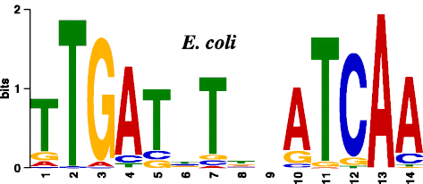

```{r setup, include=FALSE}
library(knitr)
knitr::opts_chunk$set(echo = TRUE)
```

# Practical: Alignment

```{code}

# copies all files from its parent directory to a local work directory
cp /mnt/Timina/bioinfoII/data/alignment/* /mnt/Citosina/amedina/ejorquera/BioInfoII/Tarea_2

# opens a qlogin session
qlogin

# checks module availability 
module avail

# loads a version (0.7.15) of the required program bwa, available from the module list
module load bwa/0.7.15

# loads a version (0.11.3) of the required program fastqc, available from the module list
module load fastqc/0.11.3

# loads a version (1.9) of the required program samtools, available from the module list
module load samtools/1.9

```

# E.Coli FNR ChIP-seq alignment

```{code}

# indexes the Escherichia_coli_K12_MG1655.fasta file using bwa
bwa index /mnt/Citosina/amedina/ejorquera/BioInfoII/Tarea_2/Escherichia_coli_K12_MG1655.fasta

# executes fastqc for the E.Coli FNR (Fumarate and nitrate reduction regulatory protein) transcription factor Chip-seq data file (SRX189773_FNR_ChIP.fastq)
fastqc /mnt/Citosina/amedina/ejorquera/BioInfoII/Tarea_2/SRX189773_FNR_ChIP.fastq -o output

# copies the contents of the output folder (html and compressed images output of fastqc) from the cluster into a local directory, so it can be easily opened 
scp ejorquera@dna.lavis.unam.mx:/mnt/Citosina/amedina/ejorquera/BioInfoII/Tarea_2/output/* /home/esteban/Tarea_2_Results

# Uses bwa aln to align of the E.Coli ChIP-seq for FNR (SRX189773) with the E.Coli reference genome
bwa aln /mnt/Citosina/amedina/ejorquera/BioInfoII/Tarea_2/Escherichia_coli_K12_MG1655.fasta /mnt/Citosina/amedina/ejorquera/BioInfoII/Tarea_2/SRX189773_FNR_ChIP.fastq > /mnt/Citosina/amedina/ejorquera/BioInfoII/Tarea_2/output/EColi_FNR_ChIP.sai

# Converts the single end alignment of the FNR ChIP-seq data made with bwa into a human readable sam file, so it could be later loaded by samtools stats
bwa samse /mnt/Citosina/amedina/ejorquera/BioInfoII/Tarea_2/Escherichia_coli_K12_MG1655.fasta /mnt/Citosina/amedina/ejorquera/BioInfoII/Tarea_2/output/EColi_FNR_ChIP.sai /mnt/Citosina/amedina/ejorquera/BioInfoII/Tarea_2/SRX189773_FNR_ChIP.fastq > /mnt/Citosina/amedina/ejorquera/BioInfoII/Tarea_2/output/EColi_FNR_ChIP.sam

# uses samtools view to load the sam file and print only the header
samtools view -H /mnt/Citosina/amedina/ejorquera/BioInfoII/Tarea_2/output/EColi_FNR_ChIP.sam | less -S

```

## Analysis


#### fastqc FNR ChIP-seq results:

```{r echo=FALSE}
FNR_table <- matrix(c('SRX189773_FNR_ChIP.fastq','Conventional base calls','Sanger / Illumina 1.9','3603544','0','36','49'), ncol=7, byrow=TRUE)
colnames(FNR_table) <- c('Filename','File type','Encoding','Total Sequences','Sequences flagged as poor quality','Sequence length','%GC')
FNR_DF <- as.data.frame(FNR_table)
kable(FNR_DF,align = "c")
```
According to fastqc results the FNR ChIP-seq basic statistics are correct 

```{r echo=FALSE, fig.align='center', out.width='100%'}
knitr::include_graphics('./homework_02/FNR/per_base_quality.png')
```

Similarly per base sequence quality remained consistent until the last base

```{r echo=FALSE, fig.align='center', out.width='100%'}
knitr::include_graphics('./homework_02/FNR/per_tile_quality.png')
```

We see the first mayor issue in the per tile sequence quality, as seen in the lane #26, where sequence quality is lower than the rest of the flowcell, meanwhile this error could be transient (ie. bubbles forming in the flowcell), it seems that this lane might have been damaged since all positions of the reads of this lane have lower qualities.

```{r echo=FALSE, fig.align='center', out.width='100%'}
knitr::include_graphics('./homework_02/FNR/per_base_sequence_content.png')
```

The next issue present is seen in the per base sequence content, here we should see similarly flat lines for every base, however we can see a clear preference of a base at a specific position, this indicates that a specific sequence was overrepressented, in this case the sequence we can read from the image is "GATCGGAAGAGCACACGTCTGAACTCCAGTCACACA".Considering that this is a ChIP-seq experiment, we thought that this sequence could be the biding motif of the analyzed protein.

```{r echo=FALSE, fig.align='center', out.width='50%'}

```

However, the "GATCGGAAGAGCACACGTCTGAACTCCAGTCACACA" sequence does not correspond to the binding motif of E.Coli FNR (Kumka & Bauer, 2015), meaning that the most likely cause of this error is the presence of sequencing adapters.

```{r echo=FALSE, fig.align='center', out.width='100%'}
knitr::include_graphics('./homework_02/FNR/per_sequence_gc_content.png')
```

Guanine and Cytosine content also shows errors, indicating a large fraction of reads with GC content above the expected theoretical curve, at around 53% content, we suspect this is due to the overrepressented "GATCGGAAGAGCACACGTCTGAACTCCAGTCACACA" sequence.

```{r echo=FALSE, fig.align='center', out.width='100%'}
knitr::include_graphics('./homework_02/FNR/duplication_levels.png')
```

Regarding sequence duplication events we see that there are sequences that suffered extreme duplication events having more than 5000 duplication events, which likely correspond to the "GATCGGAAGAGCACACGTCTGAACTCCAGTCACACA" sequence and its variations

```{r echo=FALSE}
FNR_seq_r1 <- c('GATCGGAAGAGCACACGTCTGAACTCCAGTCACACA','1060621','29.432719567181643','TruSeq Adapter, Index 5 (100% over 36bp)')
FNR_seq_r2 <- c('GCTAACAAATACCCGACTAAATCAGTCAAGTAAATA','13630','0.37823875606902535','No Hit')
FNR_seq_r3 <- c('NATCGGAAGAGCACACGTCTGAACTCCAGTCACACA','11728','0.3254573830651159','TruSeq Adapter, Index 5 (97% over 36bp)')
FNR_seq_r4 <- c('GTTAGCTATTTACTTGACTGATTTAGTCGGGTATTT','10983','0.304783291115635','No Hit')
FNR_seq_r5 <- c('GATCGGAAGAGCACACGTCTGAACTCCAGTCACACC','3658','0.10151117899490057','TruSeq Adapter, Index 1 (97% over 36bp)')
FNR_sequences <- rbind(FNR_seq_r1,FNR_seq_r2,FNR_seq_r3,FNR_seq_r4,FNR_seq_r5)
colnames(FNR_sequences) <- c('Sequence','Count','Percentage','Possible Source')
kable(FNR_sequences,align = "c")
```

When we analyze the overrepresented sequences, we can confirm that they correspond to adapters, specifically Illumina TruSeq adapters.

```{r echo=FALSE, fig.align='center', out.width='100%'}
knitr::include_graphics('./homework_02/FNR/kmer_profiles.png')
```

Finally, k-mer content profiles shows over-enrichment of specific sequences at certain positions, this is again likely caused by the presence of the Illumina TruSeq adapters in the dataset.

We strongly suggest to re-process the raw sequencing data using an adapter trimming software like Trimmomatic, and then re attempt the alignment 


# M.Musculus CEBPA ChIP-seq alignment

Cluster location of processed mouse (mm10) reference genome and index files:

mm10 reference genome: /mnt/Archives/genome/mouse/mm10/UCSC/bwa-0.7.15-index/index/mm10.fa

mm10 index files: /mnt/Archives/genome/mouse/mm10/UCSC/bwa-0.7.15-index/index/mm10.fa.amb /mnt/Archives/genome/mouse/mm10/UCSC/bwa-0.7.15-index/index/mm10.fa.ann /mnt/Archives/genome/mouse/mm10/UCSC/bwa-0.7.15-index/index/mm10.fa.bwt /mnt/Archives/genome/mouse/mm10/UCSC/bwa-0.7.15-index/index/mm10.fa.pac /mnt/Archives/genome/mouse/mm10/UCSC/bwa-0.7.15-index/index/mm10.fa.sa

```{code}

# executes fastqc for the compressed M.Musculus CEBPA (CCAAT/enhancer-binding protein alpha) transcription factor Chip-seq data file (mus_musculus_CEBPA_liver_ERR005132.fastq.gz)
fastqc /mnt/Citosina/amedina/ejorquera/BioInfoII/Tarea_2/mus_musculus_CEBPA_liver_ERR005132.fastq.gz -o output

# copies the html and compressed images output of fastqc for the CEBPA ChIP-seq data from the output folder located in the cluster into a local directory, so it can be easily opened 
# fastqc compressed images output
scp ejorquera@dna.lavis.unam.mx:/mnt/Citosina/amedina/ejorquera/BioInfoII/Tarea_2/output/mus_musculus_CEBPA_liver_ERR005132_fastqc.zip /home/esteban/Tarea_2_Results
# fastqc html report
scp ejorquera@dna.lavis.unam.mx:/mnt/Citosina/amedina/ejorquera/BioInfoII/Tarea_2/output/mus_musculus_CEBPA_liver_ERR005132_fastqc.html /home/esteban/Tarea_2_Results

```

Considering the file sizes of both the mus musculus reference genome and the CEBPA ChIP-seq data, the memory available to qlogin sessions might not be enough, and would likely cause the process to hang indefinitely. Therefore a sge script was generated.

```{code MMusculus.sge}
#!/bin/bash
# Use current working directory
#$ -cwd
#
# Join stdout and stderr
#$ -j y
#
# Run job through bash shell
#$ -S /bin/bash
#
#You can edit the scriptsince this line
#
# Your job name
#$ -N Marlon_job

# Send an email after the job has finished
#$ -m e
#$ -M aldarchez26@gmail.com
#
# If modules are needed, source modules environment (Do not delete the next line):
. /etc/profile.d/modules.sh
#
# Add any modules you might require
(module load bwa/0.7.15 ; bwa mem -M -t 8 /mnt/Archives/genome/mouse/mm10/UCSC/bwa-0.7.15-index/index/mm10.fa /mnt/Timina/bioinfoII/data/alignment/mus_musculus_CEBPA_liver_ERR005132.fastq.gz > /mnt/Timina/bioinfoII/marciniega/tarea_02/MMusculus_FNR_ChIP.sam)
```

```{code}
# runs the sge script to generate the CEBPA ChIP-seq data alignment in sam file format
qsub MMusculus.sge

# uses samtools stats to save  its output to a text file
samtools stats MMusculus_FNR_ChIP.sam > MMusculus_FNR_ChIP.stats

# loads samtools stats output into the nano text editor so it can be visualized
nano  MMusculus_FNR_ChIP.stats
```

## Analysis


#### fastqc CEBPA ChIP-seq results:

```{r echo=FALSE}
CEBPA_table <- matrix(c('mus_musculus_CEBPA_liver_ERR005132.fastq.gz','Conventional base calls','Sanger / Illumina 1.9','17171130','0','42','45'), ncol=7, byrow=TRUE)
colnames(CEBPA_table) <- c('Filename','File type','Encoding','Total Sequences','Sequences flagged as poor quality','Sequence length','%GC')
CEBPA_DF <- as.data.frame(CEBPA_table)
kable(CEBPA_DF,align = "c")
```

```{r echo=FALSE, fig.align='center', out.width='100%'}
knitr::include_graphics('./homework_02/CEBPA/per_base_quality.png')
```
Per base sequence quality seems to be reduced from a 28 median quality score to 8 in the total sequence lenght (42)

```{r echo=FALSE, fig.align='center', out.width='100%'}
knitr::include_graphics('./homework_02/CEBPA/per_tile_quality.png')
```
Per tile sequence quality shows that there is not a single read which does not have qualities lower than the rest of the flow cell, indicating deviation in scores that persisted for several cycles, these can be due to bubbles forming in the flowcell (at least for blue squares) but other colors could stand for important sequence errors. 

```{r echo=FALSE, fig.align='center', out.width='100%'}
knitr::include_graphics('./homework_02/CEBPA/per_sequence_quality.png')
```
As we can see in the graph the mean sequence quality has its higher point around 15 with a like-normal distribution, which shows a low sequence quality (above 1% error rate) meaning that the base call accuracy rounds beetween 90-99%.

```{r echo=FALSE, fig.align='center', out.width='100%'}
knitr::include_graphics('./homework_02/CEBPA/per_base_sequence_content.png')
```
The error in this graph is not due to the presence of adapters in the illumina sequencer, because there are not overrepresented sequences or abnormal levels of gc content.

```{r echo=FALSE, fig.align='center', out.width='100%'}
knitr::include_graphics('./homework_02/CEBPA/kmer_profiles.png')
```
This suggests that there was an error during the sequencing, as can be seen in the flowcells, which contributed to the overall low sequence quality, and mapping quality obtained from the sam file using samtools stats which is Q0 (multi-mapped reads).
