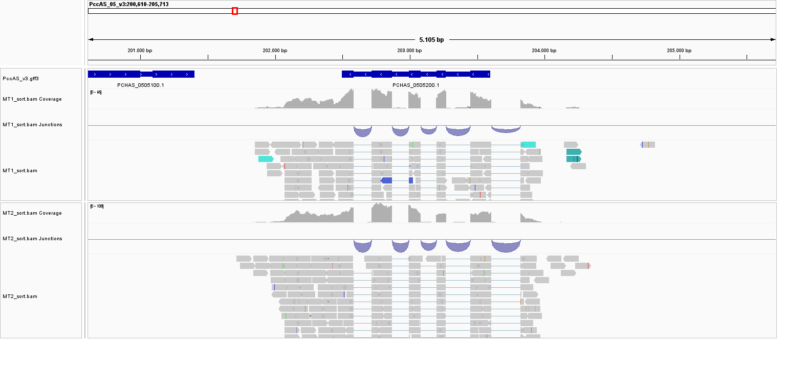
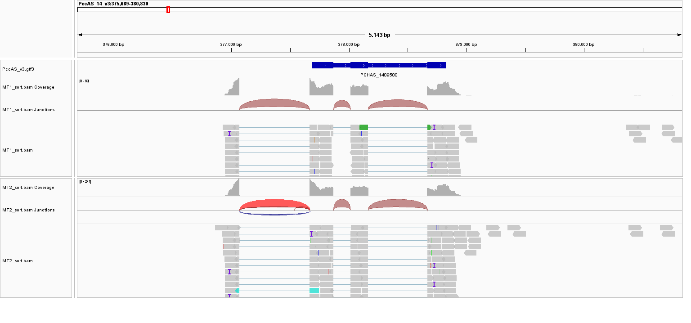
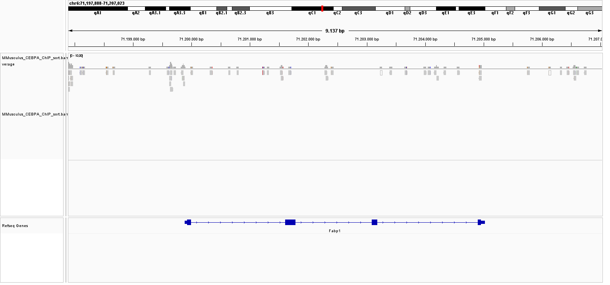
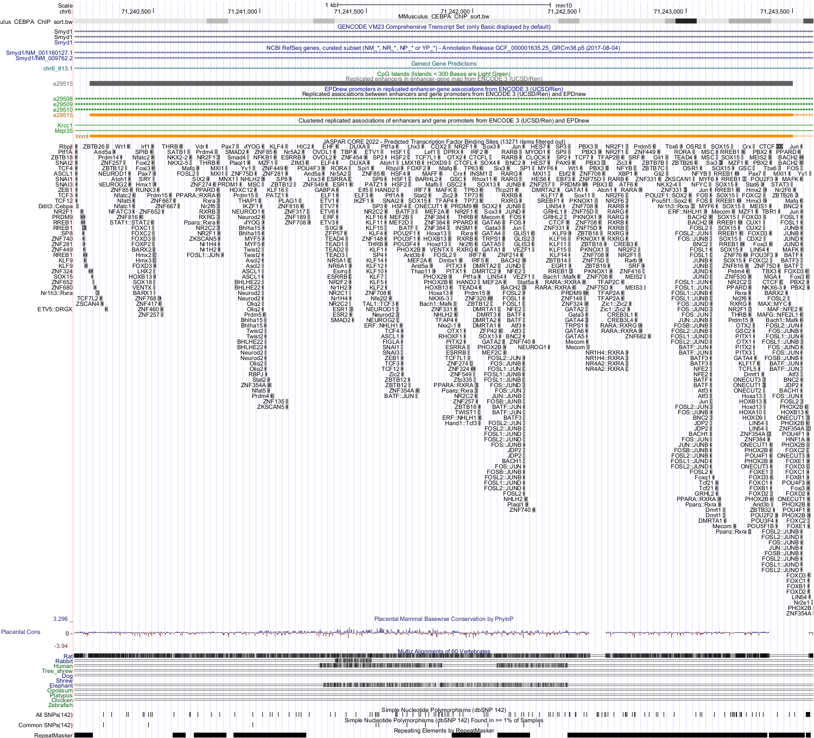

```{r setup, include=FALSE}
knitr::opts_chunk$set(echo = TRUE)
```

## Using IGV

### RNA-seq P. chabaudi AS

• -Load annotations for the genome (which one is the annotation file? What is this format describing?)

The annotation file is "PccAS_v3.gff3", the gff3 (General Feature Format) file format describes the coordinates of an annotation in this case a gene annotation

• What is the browser displaying?

The gene annotation track loaded from "PccAS_v3.gff3" over the reference genome of Plasmodium chabaudi AS contained in the "PccAS_v3_genome.fa" file and its index "PccAS_v3_genome.fa.fai"

• What happens if you zoom in or out?
If we zoom in we can see the individual genes including introns and exons, if we zoom out gene locations overlap showing the relative abundance of genes across the genome

• Load an alignment file for an RNA-seq experiment MT1 and MT2
MT1 and MT2 correspond to 2 different samples

• Is the data in the correct format?
All files are raw sequencing reads in the fastq files, and therefore not alignments, requiring aligning using a program like hisat2

• What kind of data do you need?
The data needed should be a sam or bam file which contains the reads already aligned to the reference genome 

• Why are there two files per sample?
There are 2 files per sample because the sequencing was pair-ended

#### fastqc analysis of the P. chabaudi RNA-seq reads

```{code fastqc_PccAS_v3.sge}
#!/bin/bash
# Use current working directory
#$ -cwd
#
# Join stdout and stderr
#$ -j y
#
# Run job through bash shell
#$ -S /bin/bash
#
#You can edit the scriptsince this line
#
# Your job name
#$ -N Esteban_fastqc_plasmodium

# Send an email after the job has finished
#$ -m e
#$ -M eijorquera@uc.cl
#
# Line required if modules are to be used, source modules environment
. /etc/profile.d/modules.sh
#
# Loads fastqc module,
# executes fastqc to analyze the 2 pair-ended samples of plasmodium chabaudi RNA-seq
(module load fastqc/0.11.3 ; 
fastqc /mnt/Citosina/amedina/ejorquera/BioInfoII/Tarea_3/MT1_1.fastq -o output ; 
fastqc /mnt/Citosina/amedina/ejorquera/BioInfoII/Tarea_3/MT1_2.fastq -o output ; 
fastqc /mnt/Citosina/amedina/ejorquera/BioInfoII/Tarea_3/MT2_1.fastq -o output ; 
fastqc /mnt/Citosina/amedina/ejorquera/BioInfoII/Tarea_3/MT2_2.fastq -o output)
```


#### hisat2 alignment of the P. chabaudi RNA-seq reads


```{code hisat2_PccAS_v3.sge}
#!/bin/bash
# Use current working directory
#$ -cwd
#
# Join stdout and stderr
#$ -j y
#
# Run job through bash shell
#$ -S /bin/bash
#
#You can edit the scriptsince this line
#
# Your job name
#$ -N Esteban_hisat2_plasmodium

# Send an email after the job has finished
#$ -m e
#$ -M eijorquera@uc.cl
#
# Line required if modules are to be used, source modules environment
. /etc/profile.d/modules.sh
#
# Loads hisat2 module,
# executes hisat2-build to index the plasmodium chabaudi genome
# executes hisat2 to align the 2 pair-ended samples of plasmodium chabaudi RNA-seq

(module load  hisat2/2.0.0-beta ; 
hisat2-build /mnt/Citosina/amedina/ejorquera/BioInfoII/Tarea_3/PccAS_v3_genome.fa /mnt/Citosina/amedina/ejorquera/BioInfoII/Tarea_3/PccAS_v3_hisat2.idx ; 
hisat2 --max-intronlen 10000 -x /mnt/Citosina/amedina/ejorquera/BioInfoII/Tarea_3/PccAS_v3_hisat2.idx -1 /mnt/Citosina/amedina/ejorquera/BioInfoII/Tarea_3/MT1_1.fastq -2 /mnt/Citosina/amedina/ejorquera/BioInfoII/Tarea_3/MT1_2.fastq -S /mnt/Citosina/amedina/ejorquera/BioInfoII/Tarea_3/output/MT1.sam ; 
hisat2 --max-intronlen 10000 -x /mnt/Citosina/amedina/ejorquera/BioInfoII/Tarea_3/PccAS_v3_hisat2.idx -1 /mnt/Citosina/amedina/ejorquera/BioInfoII/Tarea_3 ; /MT2_1.fastq -2 /mnt/Citosina/amedina/ejorquera/BioInfoII/Tarea_3/MT2_2.fastq -S /mnt/Citosina/amedina/ejorquera/BioInfoII/Tarea_3/output/MT2.sam)
```


#### samtools sam to bam conversion, sorting and indexing of the P. chabaudi RNA-seq alignments

```{code samtools_PccAS_v3.sge}
#!/bin/bash
# Use current working directory
#$ -cwd
#
# Join stdout and stderr
#$ -j y
#
# Run job through bash shell
#$ -S /bin/bash
#
# You can edit the script since this line
#
# Your job name
#$ -N Esteban_samtools_plasmodium

# Send an email after the job has finished
#$ -m e
#$ -M eijorquera@uc.cl
#
# Line required if modules are to be used, source modules environment
. /etc/profile.d/modules.sh
#
# Loads samtools module,
# executes samtools view for sam to bam conversion of the plasmodium chabaudi AS RNA-seq alignment data
# executes samtools sort to sort the generated bam file
# executes samtools index to index the sorted bam file 
(module load samtools/1.9 ; 
samtools view -b /mnt/Citosina/amedina/ejorquera/BioInfoII/Tarea_3/output/MT1.sam > /mnt/Citosina/amedina/ejorquera/BioInfoII/Tarea_3/output/MT1.bam ; 
samtools view -b /mnt/Citosina/amedina/ejorquera/BioInfoII/Tarea_3/output/MT2.sam > /mnt/Citosina/amedina/ejorquera/BioInfoII/Tarea_3/output/MT2.bam ; 
samtools sort /mnt/Citosina/amedina/ejorquera/BioInfoII/Tarea_3/output/MT1.bam -o /mnt/Citosina/amedina/ejorquera/BioInfoII/Tarea_3/output/MT1_sort.bam ; 
samtools sort /mnt/Citosina/amedina/ejorquera/BioInfoII/Tarea_3/output/MT2.bam -o /mnt/Citosina/amedina/ejorquera/BioInfoII/Tarea_3/output/MT2_sort.bam ;
samtools index -b /mnt/Citosina/amedina/ejorquera/BioInfoII/Tarea_3/output/MT1_sort.bam ;
samtools index -b /mnt/Citosina/amedina/ejorquera/BioInfoII/Tarea_3/output/MT2_sort.bam)
```


```{code}
#
scp ejorquera@dna.lavis.unam.mx:/mnt/Citosina/amedina/ejorquera/BioInfoII/Tarea_3/output/\{MT1_1_fastqc.html,MT1_2_fastqc.html,MT2_1_fastqc.html,MT2_2_fastqc.html,MT1_1_fastqc.zip,MT1_2_fastqc.zip,MT2_1_fastqc.zip,MT2_2_fastqc.zip\} ./
#
scp ejorquera@dna.lavis.unam.mx:/mnt/Citosina/amedina/ejorquera/BioInfoII/Tarea_3/output/\{MT1_sort.bam,MT1_sort.bam.bai,MT2_sort.bam,MT2_sort.bam.bai\} ./
```


Now we can load the BAM files to IGV... Remember you need the
index
• What do you see, explore the genome.
We see the individual reads of both samples aligned to the reference genome and we can see their aligment to the genes thanks to the annotation file

• Visualize loci: PCHAS_0505200 and PCHAS_1409500

• What do you see?
```{r echo=FALSE, fig.align='center', out.width='100%'}

```

At the gene PCHAS_0505200 we can see the alignment to the genome of the reads of both samples, reads align to the described exons in the gene, interestingly it seems that both samples are showing an extra exon or unstranslated region upstream of the annotated 1st exon

```{r echo=FALSE, fig.align='center', out.width='100%'}

```
At the gene PCHAS_1409500 we see something similar than at PCHAS_0505200, there also seems to be an extra exon upstream or unstranslated region of the annotated 1st exon, however this time the gene is in the opposite strand

• Can you export the figure?
Yes, the current browser view can be exported as either a png file or as svg file.


### CEBPA M. musculus

• Using IGV try to visualize the data for mouse ChIP-seq you generated. Is a liver data set, can you point to an interesting loci?

#### samtools sam to bam conversion, sorting and indexing of the M. musculus CEBPA ChIP-seq alignment

```{code samtools_MMusculus_CEBPA.sge}
#!/bin/bash
# Use current working directory
#$ -cwd
#
# Join stdout and stderr
#$ -j y
#
# Run job through bash shell
#$ -S /bin/bash
#
# You can edit the script since this line
#
# Your job name
#$ -N Esteban_samtools_CEBPA

# Send an email after the job has finished
#$ -m e
#$ -M eijorquera@uc.cl
#
# Line required if modules are to be used, source modules environment
. /etc/profile.d/modules.sh
#
# Loads samtools module,
# executes samtools view for sam to bam conversion of the mus musculus ChIP-seq alignment data
# executes samtools sort to sort the generated bam file
# executes samtools index to index the sorted bam file 
(module load samtools/1.9 ; 
samtools view -b /mnt/Citosina/amedina/ejorquera/BioInfoII/Tarea_2/output/MMusculus_CEBPA_ChIP.sam > /mnt/Citosina/amedina/ejorquera/BioInfoII/Tarea_3/output/MMusculus_CEBPA_ChIP.bam ; 
samtools sort /mnt/Citosina/amedina/ejorquera/BioInfoII/Tarea_3/output/MMusculus_CEBPA_ChIP.bam -o /mnt/Citosina/amedina/ejorquera/BioInfoII/Tarea_3/output/MMusculus_CEBPA_ChIP_sort.bam ;
samtools index -b /mnt/Citosina/amedina/ejorquera/BioInfoII/Tarea_3/output/MMusculus_CEBPA_ChIP_sort.bam)
```

```{r echo=FALSE, fig.align='center', out.width='100%'}

```

Here we visualize IGV browser view of the Cebpa (CCAAT/enhancer-binding protein alpha) transcription factor (TF) mouse liver ChIP-seq (Chromatin InmunoPrecipitation sequencing) data aligned to the mm10 reference genome, displaying the genome regions bound by this TF. Specifically in this picture we show the gene Fabp1 (Fatty acid-binding protein 1), a hepatocyte produced enzyme that participates in lipoprotein-mediated cholesterol uptake. Here we can see multiple regions where Cebpa is bound to the Fabp1 gene


#### deeptools bam to bigwig conversion of the M. musculus CEBPA ChIP-seq alignment

```{code deeptools_MMusculus_CEBPA.sge}
#!/bin/bash
# Use current working directory
#$ -cwd
#
# Join stdout and stderr
#$ -j y
#
# Run job through bash shell
#$ -S /bin/bash
#
# You can edit the script since this line
#
# Your job name
#$ -N Esteban_deeptools_CEBPA

# Send an email after the job has finished
#$ -m e
#$ -M eijorquera@uc.cl
#
# Line required if modules are to be used, source modules environment
. /etc/profile.d/modules.sh
#
# Loads deeptools module,
# executes bamCoverage for bam to bw conversion of the mus musculus ChIP-seq alignment data
(module load deeptools/2.5.3 ; 
bamCoverage -b /mnt/Citosina/amedina/ejorquera/BioInfoII/Tarea_3/output/MMusculus_CEBPA_ChIP_sort.bam -o /mnt/Citosina/amedina/ejorquera/BioInfoII/Tarea_3/output/MMusculus_CEBPA_ChIP_sort.bw)
```

```{r echo=FALSE, fig.align='center', out.width='100%'}
knitr::include_graphics('./homework_03/UCSC_CEBPA_ChIP_Fabp1.png')
```

Here we visualize UCSC browser view of the Cebpa (CCAAT/enhancer-binding protein alpha) transcription factor (TF) mouse liver ChIP-seq (Chromatin InmunoPrecipitation sequencing) data aligned to the mm10 reference genome, displaying the genome regions bound by this TF. Specifically in this picture we show the gene Fabp1 (Fatty acid-binding protein 1), a hepatocyte produced enzyme that participates in lipoprotein-mediated cholesterol uptake. Here we can see multiple regions where Cebpa is bound to the Fabp1 gene.
For this specific image we included tracks depicting gene predictions, regulatory elements like CPG islands and enhancers, and also predicted TF binding sites according to the JASPAR core 2022 TF binding motif library.
As we can see some of the biding regions found in the ChIP-seq experiment are also reported as possible binding sites for either "CEBPA" or "Ddit3::Cebpa", which would be the biding motif of the Cebpa-Ddit3 protein dimer. It is worth mentioning that some of the Cebpa binding sites found in the experiment were predicted binding sites for proteins such as CEBPG and CEBPD, which are related proteins (members of the Basic leucine zipper (bZIP) family) with somewhat similar binding motifs.
On a sidenote the closest described enhancer we could find is located in the Smyd1 gene, this enhancer does not have a predicted binding site for Cebpa, however it does have some weak ChIP-seq signals

```{r echo=FALSE, fig.align='center', out.width='100%'}

```

