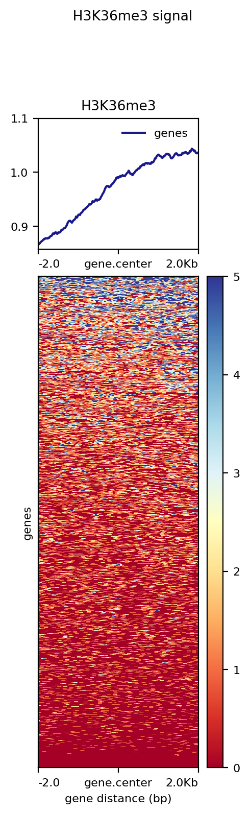
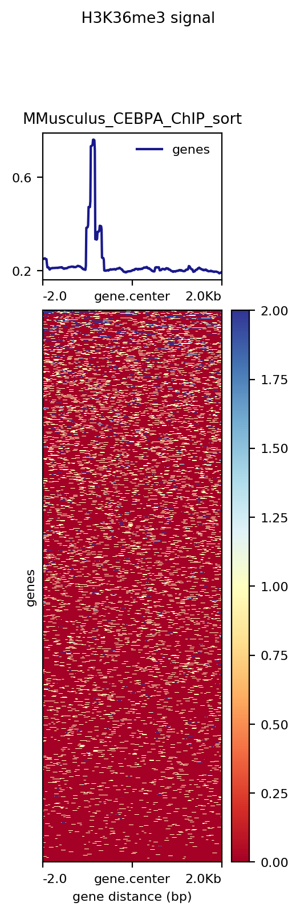
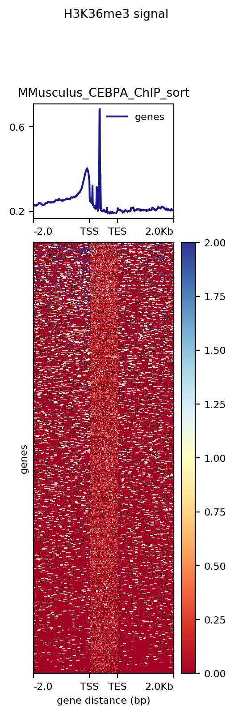
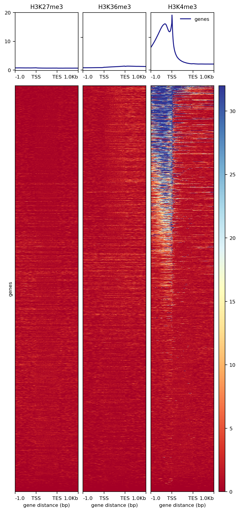

```{r setup, include=FALSE}
knitr::opts_chunk$set(echo = TRUE)
```

#### deeptools heatmap visualization of Human H3K36me3 ChIP data

```{code deeptools_H3K36me3.sge}
#!/bin/bash
# Use current working directory
#$ -cwd
#
# Join stdout and stderr
#$ -j y
#
# Run job through bash shell
#$ -S /bin/bash
#
# You can edit the script since this line
#
# Your job name
#$ -N Esteban_deeptools_H3K36me3

# Send an email after the job has finished
#$ -m e
#$ -M eijorquera@uc.cl
#
# Line required if modules are to be used, source modules environment
. /etc/profile.d/modules.sh
#
# Loads deeptools module,
# executes computeMatrix and plotHeatmap to generate a heatmap of human H3K36me3 ChIP-seq coverage
(module load deeptools/2.5.3 ; 
computeMatrix reference-point -S /mnt/Citosina/amedina/ejorquera/BioInfoII/Tarea_4/H3K36me3.bw -R /mnt/Citosina/amedina/ejorquera/BioInfoII/Tarea_4/Human38_genesGencodev32.bed --referencePoint center -a 2000 -b 2000 -out /mnt/Citosina/amedina/ejorquera/BioInfoII/Tarea_4/matrix_H3K36me3_matrix.tab.gz ; 
plotHeatmap -m /mnt/Citosina/amedina/ejorquera/BioInfoII/Tarea_4/matrix_H3K36me3_matrix.tab.gz -out /mnt/Citosina/amedina/ejorquera/BioInfoII/Tarea_4/output/H3K36me3_genes.png --heatmapHeight 15 --refPointLabel gene.center --regionsLabel genes --plotTitle ' H3K36me3 signal')
```

```{r echo=FALSE, fig.align='center', out.width='100%'}

```

Deeptools was used to generate a heatmap depicting the overall coverage of the H3K36me3 histone mark across the Human genome for an already processed chromatin IP experiment. The data was plotted using a reference-point based matrix, in this case the gene's center, this way in the image we observe the overall abundance of the histone mark across all genes centered to each gene center with a window of ± 2000 base pairs, disregarding the overall length of the gene, for this reason we might not be seeing other biding locations, since they might be located outside the 4 kbp window. This said, we observe that the mark gets enriched towards the Transcription Ending Site (TES), away from the promoters and Transcription Start Site (TSS) which would be in accordance to the marker of gene bodies nature of the H3K36me3 mark. 

#### deeptools heatmap visualization of M. musculus Cebpa ChIP data

```{code}
# Downloads the mm10 annotation generated by UCSC which was uploaded to cyverse 
wget https://data.cyverse.org/dav-anon/iplant/home/estebanjorquera/mm10_NCBI_RefSeq.gz
```

The previously generated bigwig file for mus musculus Cebpa ChIP-seq data was uploaded to cyverse to be then downloaded/shared.

```{code deeptools_CEBPA.sge}
#!/bin/bash
# Use current working directory
#$ -cwd
#
# Join stdout and stderr
#$ -j y
#
# Run job through bash shell
#$ -S /bin/bash
#
# You can edit the script since this line
#
# Your job name
#$ -N Esteban_deeptools_CEBPA

# Send an email after the job has finished
#$ -m e
#$ -M eijorquera@uc.cl
#
# Line required if modules are to be used, source modules environment
. /etc/profile.d/modules.sh
#
# Loads deeptools module,
# executes computeMatrix and plotHeatmap to generate a heatmap of mus musculus Cebpa ChIP-seq coverage
# centered at gene center and scaled to gene lenght
(module load deeptools/2.5.3 ; 
computeMatrix reference-point -S /mnt/Citosina/amedina/ejorquera/BioInfoII/Tarea_4/MMusculus_CEBPA_ChIP_sort.bw -R /mnt/Citosina/amedina/ejorquera/BioInfoII/Tarea_4/mm10_NCBI_RefSeq.bed.gz --referencePoint center -a 2000 -b 2000 -out /mnt/Citosina/amedina/ejorquera/BioInfoII/Tarea_4/matrix_MMusculus_CEBPA_ChIP.tab.gz ; 
plotHeatmap -m /mnt/Citosina/amedina/ejorquera/BioInfoII/Tarea_4/matrix_MMusculus_CEBPA_ChIP.tab.gz -out /mnt/Citosina/amedina/ejorquera/BioInfoII/Tarea_4/output/CEBPA_genes.png --heatmapHeight 15 --refPointLabel gene.center --regionsLabel genes --plotTitle ' CEBPA signal' ;
computeMatrix scale-regions -S /mnt/Citosina/amedina/ejorquera/BioInfoII/Tarea_4/MMusculus_CEBPA_ChIP_sort.bw -R /mnt/Citosina/amedina/ejorquera/BioInfoII/Tarea_4/mm10_NCBI_RefSeq.bed.gz --startLabel TSS --endLabel TES -a 2000 -b 2000 -out /mnt/Citosina/amedina/ejorquera/BioInfoII/Tarea_4/matrix_MMusculus_CEBPA_ChIP_scale.tab.gz ; 
plotHeatmap -m /mnt/Citosina/amedina/ejorquera/BioInfoII/Tarea_4/matrix_MMusculus_CEBPA_ChIP_scale.tab.gz -out /mnt/Citosina/amedina/ejorquera/BioInfoII/Tarea_4/output/CEBPA_genes_scale.png --heatmapHeight 15 --startLabel TSS --endLabel TES --regionsLabel genes --plotTitle ' CEBPA signal')
```

```{r echo=FALSE, fig.align='center', out.width='100%'}

```

Similarly to the previous task, deeptools was used to generate a heatmap depicting the overall coverage of, in this case, the Cebpa TF across the mice genome for the visualization data generated in the previous homework. Just like before, the data was plotted using a reference-point based matrix centered at the gene's center with a window of ± 2 kbp. As shown in the image, we observe a sharp peak that marks the enrichment of Cebpa binding events to the left of the gene center, towards the genes TSS, which would be in accordance to its nature as a transcription factor. 

```{r echo=FALSE, fig.align='center', out.width='100%'}

```

Considering the potential issue pointed previously regarding the limiting nature of a ± 2 kbp window, and that genes can be much larger than 4 kbp, we also ran the dataset using the scale-regions mode of deeptools, this way all genes would be scaled in accordance to each other and which would allow us to observe Cebpa's enrichment across the entirety of the gene body. Here we observe that Cebpa is indeed enriched near the TSS, specifically before and after it. We had hoped to observe biding events that were further from the genes, considering that Cebpa is also a known enhancer binding protein, however the extra 2 kbp window was too small to do this.

#### deeptools heatmap visualization of Human H3K27me3, H3K36me3, H3K4me3 ChIP data

```{code deeptools_HistoneMarks.sge}
#!/bin/bash
# Use current working directory
#$ -cwd
#
# Join stdout and stderr
#$ -j y
#
# Run job through bash shell
#$ -S /bin/bash
#
# You can edit the script since this line
#
# Your job name
#$ -N Esteban_deeptools_HistoneMarks

# Send an email after the job has finished
#$ -m e
#$ -M eijorquera@uc.cl
#
# Line required if modules are to be used, source modules environment
. /etc/profile.d/modules.sh
#
# Loads deeptools module,
# executes computeMatrix and plotHeatmap to generate a heatmap of human histone marks
(module load deeptools/2.5.3 ; 
computeMatrix scale-regions -S /mnt/Citosina/amedina/ejorquera/BioInfoII/Tarea_4/H3K27me3.bw /mnt/Citosina/amedina/ejorquera/BioInfoII/Tarea_4/H3K36me3.bw /mnt/Citosina/amedina/ejorquera/BioInfoII/Tarea_4/H3K4me3.bw -R /mnt/Citosina/amedina/ejorquera/BioInfoII/Tarea_4/Human38_genesGencodev32.bed --beforeRegionStartLength 1000 --regionBodyLength 1000 --afterRegionStartLength 1000 --skipZeros -o matrix.mat.gz ; 
plotHeatmap -m matrix.mat.gz -out /mnt/Citosina/amedina/ejorquera/BioInfoII/Tarea_4/output/HistoneMarkHeatmap.png)
```

```{r echo=FALSE, fig.align='center', out.width='100%'}

```

Deeptools was used again to visualize the coverage of multiple histone marks, specifically H3K4me3, H3K27me3 and H3K36me3, in the human genome, at the same time. This time a scaled approach was used to compute the matrix for the heatmap generation with a window of ± 1 kbp. As shown in the heatmap, now we can see a clear difference in the ChIP-seq signals, unlike the first task where the ChIP-seq signal of H3K36me3 was low, as depicted by the mostly red color, instead here we see a very clear difference for the H3K4me3 histone mark where there is a strong enrichment of the mark close to the TSS, specially directly before it, to the point that in comparison the strength of both either H3K27me3 and H3K26me3 is negligible. This H3K4me3 enrichment near the TSS is in accordance to its nature as a promoter marker of active genes. We don't observe a particular enrichment of the H3K27me3 mark, which is a marker of repressed genes, we can't be sure if this is due to some issue arising from the ChIP-seq experiment itself (like the affinity of the used antibodies for the chromatin immunoprecipitation), nature of the samples, issues with the sequencing, or the normalization of the data, as we should expect a fraction of the genes to be silent, and in the case of H3K36me3, a similar profile to the one seen in the first task, where it is enriched away from the TSS in a mirror image of sorts to the H3K4me3 enrichment profile.

### Improving visualization skills in R

```{r results = FALSE, message=FALSE, warning=FALSE, echo=TRUE, Packages_Dependencies}
# Installs required packages if not already installed (avoids re installing)
if (!requireNamespace("tidytuesdayR", quietly = TRUE))   install.packages("tidytuesdayR")
if (!requireNamespace("ggplot2", quietly = TRUE))        install.packages("ggplot2")
if (!requireNamespace("dplyr", quietly = TRUE))          install.packages("dplyr")
if (!requireNamespace("tidyr", quietly = TRUE))          install.packages("tidyr")
if (!requireNamespace("tidyverse", quietly = TRUE))      install.packages("tidyverse")

# Libraries
library(ggplot2)
library(dplyr)
library(tidyr)
library(tidyverse)
```

First we installed the required libraries to be used in the task, in this case the tidy tuesday package is to be used to select a specific dataset

```{r results = FALSE, message=FALSE, warning=FALSE, echo=TRUE, American_Kennel_Club_Dog_Data}
# Loads dog breed trait and ranking data as dataframes
DogData_breed_traits <- readr::read_csv('https://raw.githubusercontent.com/rfordatascience/tidytuesday/master/data/2022/2022-02-01/breed_traits.csv')
DogData_trait_description <- readr::read_csv('https://raw.githubusercontent.com/rfordatascience/tidytuesday/master/data/2022/2022-02-01/trait_description.csv')
DogData_breed_rank_all <- readr::read_csv('https://raw.githubusercontent.com/rfordatascience/tidytuesday/master/data/2022/2022-02-01/breed_rank.csv')
```

The dog breed ranking data of the American Kennel Club was selected and imported as dataframes to be used for the exercise

```{r echo=TRUE, Data_processing}
# Adds an average ranking column to the dataset
DogData_breed_rank_edited <- DogData_breed_rank_all
DogData_breed_rank_edited$Average.Score <- rowMeans(
  DogData_breed_rank_edited[,(2:9)],
  na.rm=TRUE
  )  
# Renames the columns
DogData_breed_rank_edited <- rename(
  DogData_breed_rank_edited,
  "2013" = "2013 Rank",
  "2014" = "2014 Rank",
  "2015" = "2015 Rank",
  "2016" = "2016 Rank",
  "2017" = "2017 Rank",
  "2018" = "2018 Rank",
  "2019" = "2019 Rank",
  "2020" = "2020 Rank",
  )

DogData_breed_rank_subset <- DogData_breed_rank_edited %>% 
  # Drops rows with NAs in the Average.Score column, just in case, not used this time 
  drop_na(Average.Score) %>% 
  # Sorts rows according to the average ranking over the period
  arrange(Average.Score) %>% 
  # Gets the top 10 average scoring dog breeds, the best boys of the best boys
  slice_min(Average.Score, n = 10)

# Converts the dataframe from a wide format to a long format
DogData_breed_rank_long <- pivot_longer(
  DogData_breed_rank_subset[1:9],
  cols = -Breed
)
# Renames the columns
DogData_breed_rank_long <- rename(
  DogData_breed_rank_long,
  "Year" = "name",
  "Ranking" = "value"
  )

# Best boy breed popularity plotting
ggplot(data = DogData_breed_rank_long, aes(x = Year, y = Ranking, group = Breed)) +
  geom_line(aes(linetype = Breed, color=Breed)) + 
  scale_y_reverse() +
  geom_point(shape=18, aes(color=Breed)
  )
```
The American Kennel Club dog breed ranking data across the period 2013-2020 was used to select the top 10 ranked breeds during the evaluated period, this data was then plotted to visualize the yearly popularity and its changes for the most popular dog breeds. Interestingly we observe a sharp decline in the popularity of Yorkshire Terriers, and a meteoric rise for French Bulldogs, both Beagles and Pointers show a steady trend, decreasing and rising, respectively. Perhaps unsurprisingly, German Shepherds and Retrievers remain mostly uncontested in their popularity.
